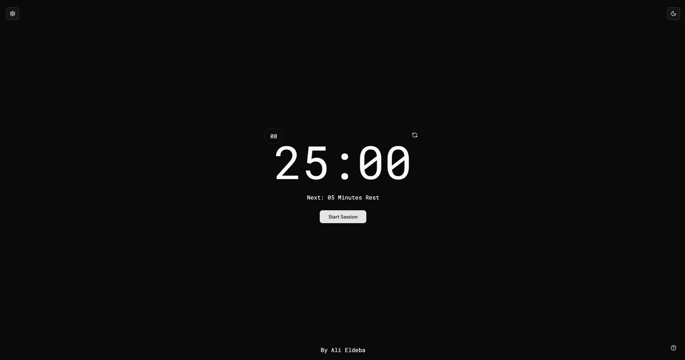
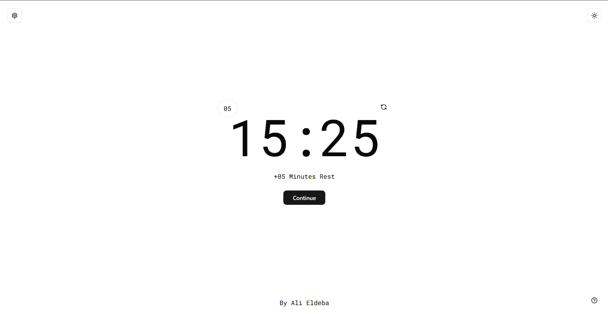
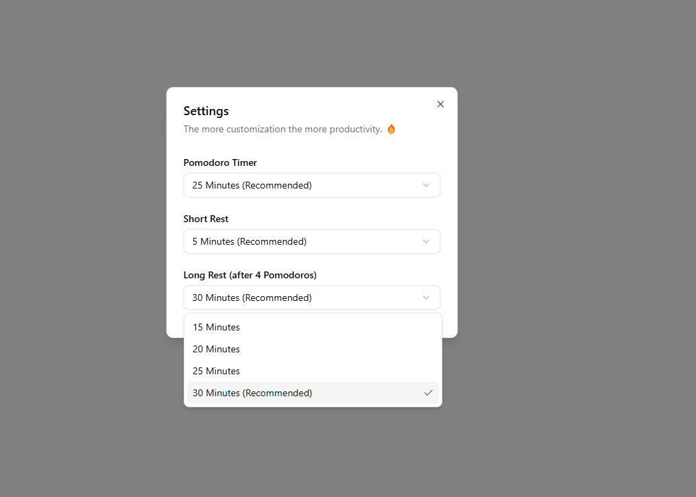

<h1 align="center">✨ Pomodoro Timer ✨</h1>

A simple and minimalist desktop Pomodoro timer application to boost productivity by following the Pomodoro Technique.







## Features

- **Work and Rest Sessions**: Default 25-minute work sessions followed by 5-minute breaks.
- **Dark & Light Mode**: Toggle between dark and light themes for better visibility.
- **Session Tracker**: Keeps track of completed Pomodoro sessions.
- **Pause & Resume**: Pause and resume sessions whenever needed.
- **Reset Timer**: Restart the timer at any time.
- **Responsive Design**: Works across all devices.

```bash
git clone https://github.com/alieldeba/Pomodoro.git
cd Pomodoro
npm install
npm run dev
```

## Usage

1. Open the app.
2. Click **Start Session** to begin a Pomodoro session.
3. After 25 minutes, take a 5-minute break.
4. Repeat the process to stay productive.

## Technologies Used

- **Next.js** – For the frontend framework.
- **React** – UI components.
- **Tailwind CSS** – Styling.
- **ShadCN** – UI elements.

## License

This project is licensed under the MIT License.

## Author

Developed by **Ali Eldeba**
